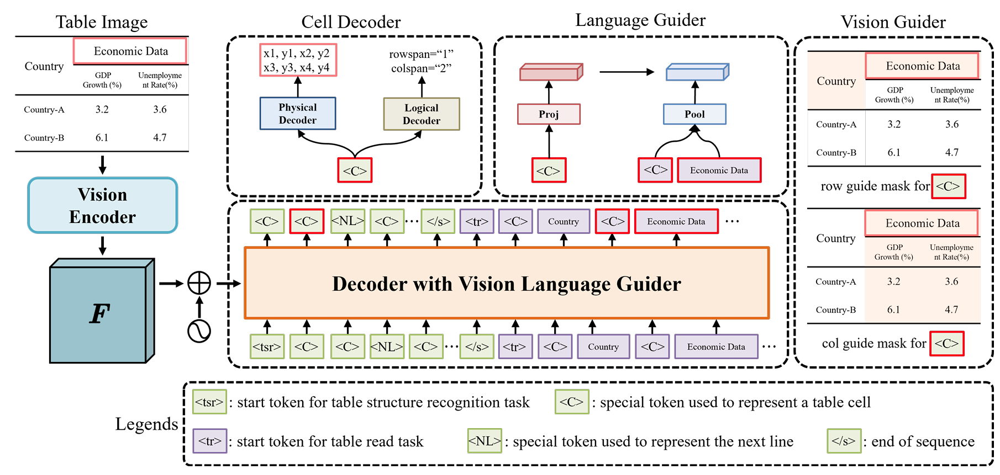
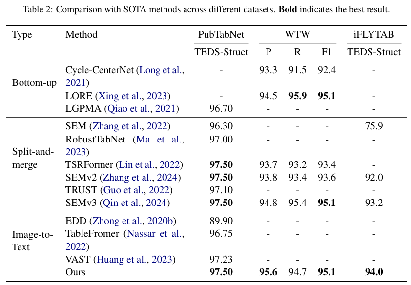
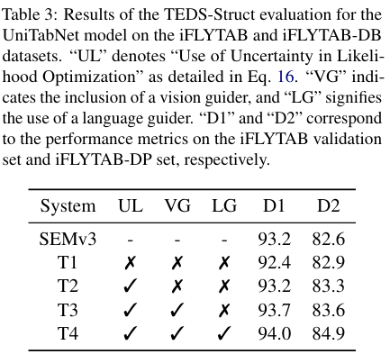

# UniTabNet: Bridging Vision and Language Models for Enhanced Table Structure Recognition

This repository contains the source code of UniTabNet: [UniTabNet: Bridging Vision and Language Models for Enhanced Table Structure Recognition]([[2409.13148\] UniTabNet: Bridging Vision and Language Models for Enhanced Table Structure Recognition](https://arxiv.org/abs/2409.13148)).

### Introduction

<p align="center">
  
</p>
 In this paper, we introduce UniTabNet, a novel framework for table structure parsing based on the image-to-text model. UniTabNet employs a “divide-and-conquer” strategy, utilizing an image-to-text model to decouple table cells and integrating both physical and logical decoders to reconstruct the complete table structure. We further enhance our framework with the Vision Guider, which directs the model’s focus towards pertinent areas, thereby boosting prediction accuracy. Additionally, we introduce the Language Guider to refine the model’s capability to understand textual semantics in table images. 


### Metric

We use both F1-Measure [1] and Tree-Edit-Distance-based Similarity (TEDS) [2] metric, which are commonly adopted in table structure recognition literature and competitions, to evaluate the performance of our model for recognition of the table structure. The evaluation code can be found in the `UniTabNet/evaluation/` folder.

[1] [M. Hurst, A constraint-based approach to table structure derivation, in: ICDAR, 2003.](https://ieeexplore.ieee.org/document/1227792)

[2] [X. Zhong, E. ShafeiBavani, A. Jimeno Yepes, Image-based table recognition: Data, model, and evaluation, in: ECCV, 2020.](https://www.ecva.net/papers/eccv_2020/papers_ECCV/papers/123660562.pdf)


### Performance

We perform comprehensive experiments on the PubTabNet, PubTa bles1M, WTW and iFLYTAB to verify the effectiveness of UniTabNet.

<span style="font-size: 20px;">•</span> Comparison with SOTA

<p align="center">
  
</p>


<span style="font-size: 20px;">•</span> Ablation Study

<p align="center">
  
</p>

## Requirements


```
pip install requirements.txt
```


## Training


```
cd UniTabNet/scripts/train/
sh train.sh
```


## Citation


If you find UniTabNet useful in your research, please consider citing:

```
@misc{
  zhang2024unitabnet,
  title={UniTabNet: Bridging Vision and Language Models for Enhanced Table Structure Recognition}, 
  author={Zhenrong Zhang and Shuhang Liu and Pengfei Hu and Jiefeng Ma and Jun Du and Jianshu Zhang and Yu Hu},
  year={2024},
  eprint={2409.13148},
  archivePrefix={arXiv},
  primaryClass={cs.CV}
}
```
